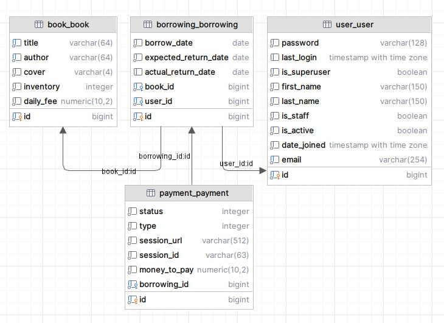
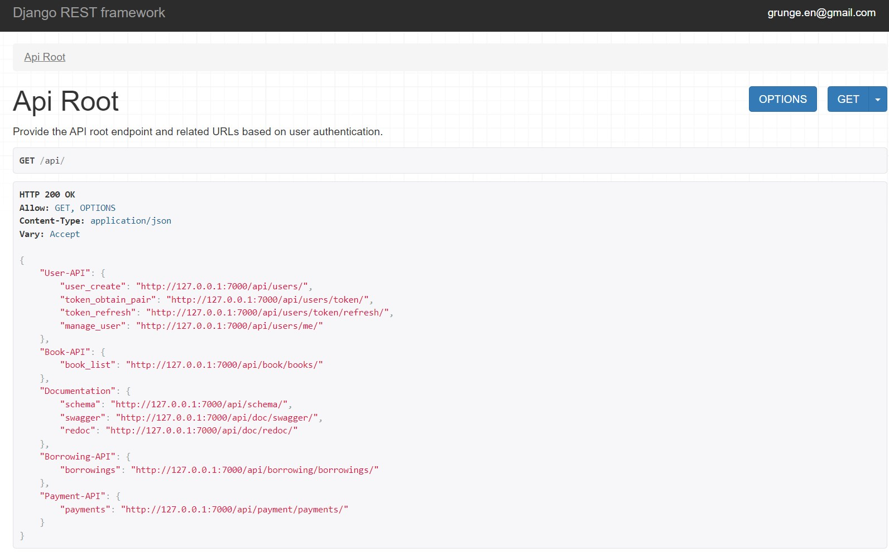

# Library Management System

An online management system for book borrowings that optimizes the work of library administrators and makes the service more user-friendly.

## Features

**Authentication and Authorization**:

* Users need to be authenticated before they can access the features of the system.
* Admin users have additional privileges to manage information within the system.

**Books Inventory Management**:

* The system manages the inventory of books, allowing CRUD operations for books.

**Borrowing Management**:

* Users can borrow books and create borrowing records.
* Users can return books, updating the inventory accordingly.
* Filtering for active borrowings and specific users' borrowings is available.

**Users Management**:

* The system manages user authentication and user registration.
* Users can update their profile information.

**Notifications**:

* The system sends notifications about new borrowings created, overdue borrowings, and successful payments.
* Notifications are sent through a Telegram chat.

**Payments Handling**:

* The system supports payments for book borrowings through the Stripe platform.

**Swagger Documentation**

**Docker Containerization**

* The application is containerized using Docker for simplified deployment and management.

## Demo

This section contains a screenshot showcasing links to the main functional capabilities of the project.


## Technologies

[Django](https://docs.djangoproject.com/en/4.2/) - A high-level Python web framework that encourages rapid development and clean, pragmatic design.

[Django Rest Framework (DRF)](https://www.django-rest-framework.org/) - A powerful and flexible toolkit for building Web APIs.

[PostgreSQL](https://www.postgresql.org/docs/) - A powerful, open-source object-relational database system.

[Redis](https://redis.io/documentation) - An open-source, in-memory data structure store used as a database, cache, and message broker.

[Celery](https://docs.celeryproject.org/en/stable/) - An asynchronous task queue/job queue based on distributed message passing.

[Stripe](https://stripe.com/docs) - A platform for processing online payments, commonly used in Django Rest Framework projects to manage financial transactions in web applications.

[Python-dotenv](https://pypi.org/project/python-dotenv/) - A Python module that reads key-value pairs from a .env file and can set them as environment variables.

[Flower](https://flower.dev/docs/) - A web-based tool for monitoring and administrating Celery clusters.

[Telegram API](https://core.telegram.org/bots/api) - An API that enables the integration of Telegram functionality into applications, allowing for the sending of notifications through Telegram chats.

[Docker](https://docs.docker.com/) - A platform for developing, shipping, and running applications using containerization.

[Swagger](https://swagger.io/docs/) - An open-source software framework backed by a large ecosystem of tools that helps developers design, build, document, and consume RESTful web services.

[JWT](https://jwt.io/introduction/) - JSON Web Tokens are used for securely transmitting information between parties as a JSON object.

## Architecture

The database structure is as follows:



## Demo

This section contains a screenshot showcasing links to the main functional capabilities of the project.



## Installation

### Using GitHub

1. Clone the repository:

```shell
git clone https://github.com/OlegatorLE/library-team-project
cd library-team-project
```

2. Set up the virtual environment and install the required dependencies:

```shell
python -m venv venv
source venv/Scripts/activate (on Windows)
source venv/bin/activate (on macOS)
pip install -r requirements.txt
```

3. Generate a .env file from .env.sample.


4. Run the database migrations and load initial data:

```shell
python manage.py migrate
python manage.py loaddata library_db_data.json
```

5. Run the development server:
```shell
python manage.py runserver
```
## Run with Docker
* Ensure Docker is installed and set up.

* Execute the following command to build and start the Docker containers:

```shell
docker-compose up --build
```

## Getting Access through JWT
* Create a user using the /api/users/ endpoint.
* Retrieve an access token using the /api/users/token endpoint.


## Swagger Documentation
Access the API documentation at 

```shell
/api/doc/swagger
```

## Acknowledgments

We would like to extend our gratitude to our mentors, Ivan Ramyk and Serhii Leonenko, for their valuable guidance and thorough review throughout the development and consultation process. Thank you for your support and insights.